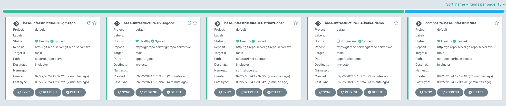
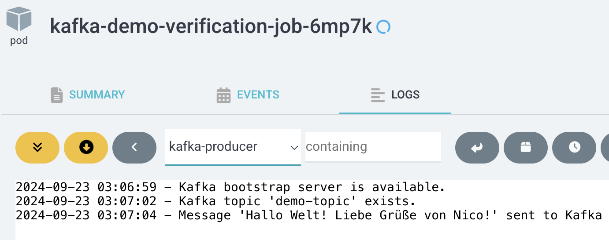
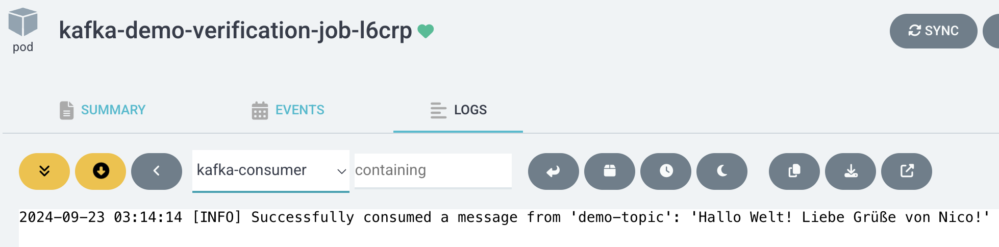
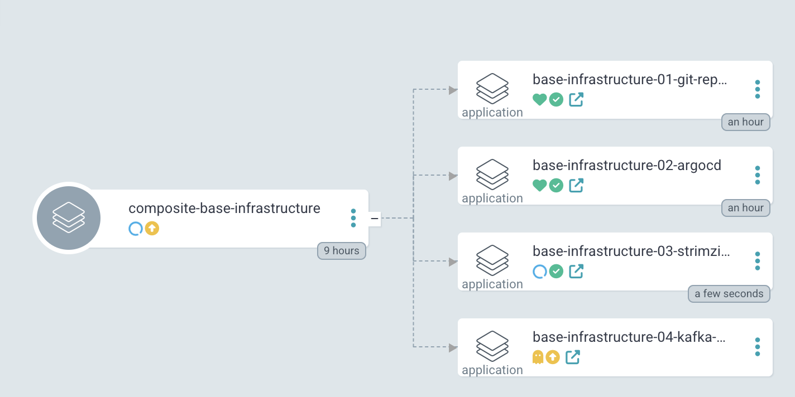

# Strimzi Kafka Operator Demo

Welcome to this Strimzi Kafka Operator Demo! This repository provides a fully reproducible development environment using a [devcontainer](https://containers.dev).
It can be started as a Github Codespace free of charge and is ready in less than 3 minutes.

The devcontainer automatically sets up:

- **K3s Kubernetes Cluster**: A lightweight but fully functional Kubernetes cluster.
- **Local Git Server**: Hosts the GitOps repository within the cluster and is pre-configured to synchronize with ArgoCD.
- **GitOps Bootstrap**: ArgoCD is automatically initialized and connected to a local Git repository during setup.
- **Strimzi Operator Deployment**: Deploys the Strimzi kafka operator via Argo CD.
- **Kafka Deployment**: Deploys a Kafka cluster using Strimzi, along with Zookeeper replicas and Kafka broker replicas.
- **Argo CD PostSync Hook to Verify Kafka Deployment**: Includes an Argo CD post sync hook job that sends and consumes a message to verify the setup and mark the sync as succeeded / failed.

## Getting Started

You can run the devcontainer in this repository with GitHub Codespaces.

To begin, [launch a new Codespace using the default settings.](https://codespaces.new/kutespaces/argocd)

Running this Codespace in the browser will not work. As soon as the Codespace is ready, launch it in your local VS Code Desktop.
To do so, extend the menu in the upper left corner and select `Open in VS Code Desktop`.


To properly view the rendered README, either view it in your browser or open the Command Palette (Ctrl+Shift+P) and select `Markdown: Open Preview`.

## Verify the setup

*Note: The setup may take another minute after the Codespace has loaded for kubectl and the Argo CD dashboard to be available.*

### Verify kubectl works.
Start by ensuring you can interact with Kubernetes:

1. Request the nodes; you should see a single node returned:
    ```shell
    kubectl get nodes
    ```
2. Check the pods across all namespaces. Look for services like ArgoCD, a local Git server, and a Traefik load balancer:
    ```shell
    kubectl get pods --all-namespaces
    ```

### Access the ArgoCD Dashboard

Access the ArgoCD dashboard through your browser. Use the URL format `http://argocd.127.0.0.1.nip.io:<FORWARDED_K3D_INGRESS_PORT>`. The load balancer listens on port 8080, which is forwarded to your local machine. Locate your local machine's corresponding port by opening your VS Code terminal and switching to the `PORTS` tab. Usually, `FORWARDED_K3D_INGRESS_PORT` will be `8080`. However, in the example below, it is `64578` because 8080 was taken on my machine.


Login with the credentials `admin:admin` to view the dashboard. You should see the following three ArgoCD applications. If it looks like below, everything worked out!



## Exercise Results

In this demo, we deployed the Strimzi Kafka Operator. The deployment configuration is located in `manifests/apps/strimzi-operator`.

A Kafka cluster is deployed via `manifests/apps/kafka-demo`. It includes three Zookeeper replicas and three Kafka broker replicas. The setup also includes a UserOperator and a TopicOperator which deploys a demo topic.

There is an Argo CD post sync hook included in `manifests/apps/kafka-demo/kafka-demo-verification-job.yaml` to verify the setup.
It tries to send a message to the `demo-topic` and then consumes it. Depending on the outcome it marks the Argo CD sync as succeeded or failed.

```yaml
apiVersion: batch/v1
kind: Job
metadata:
  name: kafka-demo-verification-job
  annotations:
    argocd.argoproj.io/hook: PostSync
```
To verify the setup manually, you can check the logs in the ArgoCD dashboard.

1. Access the ArgoCD dashboard.
2. Navigate to the application: `argocd_base-infrastructure-04-kafka-demo`. Open the logs of the `kafka-demo-demo-verification` job's pod.
3. If the setup is functioning correctly, you will see the following message in the logs. The timeout exception in the consumer is intended to stop the consumer after 10 seconds.

A produced message should be logged in the `kafka-producer` container.



A consumed message should be logged in the `kafka-consumer` container.



## Reliability Improvements for the GitOps Setup

Our main goal is to deploy a single "app of apps" to bootstrap the cluster, ensuring that all applications are synced in the correct order—for example, deploying a database before a backend service. This sequence guarantees that all applications sync successfully and pass their health checks instead of getting stuck.

In this demo, we need to manage the sync order of Argo CD Applications carefully. Specifically, we cannot reliably deploy the Strimzi Operator and the Kafka Demo simultaneously because the Kafka Custom Resource depends on the CRDs provided by the Strimzi Kafka Operator. Simply adding a numeric prefix to the application manifests affects only the apply order to the API and is not a reliable method to define dependencies.

For instance, during the setup of this codespace in `.devcontainer/on-create.sh`, I install Argo CD first but cannot immediately create the Argo CD application manifests. I need to ensure that the CRDs are fully installed before creating the `Application` manifests. If I proceed too soon, the CRDs might not be fully installed, causing the creation of Argo CD Applications to fail. See the code snippet below for reference.

```bash
  kubectl apply -k manifests/apps/argocd/

  # Wait for the argocd application CRD to be installed
  ELAPSED_TIME=0
  until kubectl get crd applications.argoproj.io &> /dev/null || [ $ELAPSED_TIME -ge 90 ]; do
    echo "Waiting for Argo CD Application CRD to be installed..."
    sleep 5
    ELAPSED_TIME=$((ELAPSED_TIME+5))
  done
```

Two key improvements to enhance the reliability of our GitOps setup are the implementation of sync waves and retries. These features are essential for applying a single root application manifest, ensuring that every sub-application (and even nested sub-applications) can be synced successfully in one go without manual intervention. This is particularly beneficial when the cluster setup and all its applications are fully automated.

### Sync waves

Sync waves in Argo CD help manage sync dependencies. By using sync waves as shown below, you can ensure the Strimzi Kafka Operator is installed before the Kafka Demo is synced.


```yaml
composite-base:
  applications:
    ...
    03-strimzi-operator:
      path: apps/strimzi-operator
      namespace: strimzi-operator
      source:
        helm:
          releaseName: strimzi-operator
      syncWave: 100
    04-kafka-demo:
      path: apps/kafka-demo
      syncWave: 200
```

For sync waves to work properly, we need to implement a health check for Argo CD applications as described in the [Argo CD documentation](https://argo-cd.readthedocs.io/en/stable/operator-manual/health/#argocd-app). This patch is added to the `argocd-cm` config map.

```lua
resource.customizations.health.argoproj.io_Application: |
  hs = {}
  hs.status = "Progressing"
  hs.message = ""
  if obj.status ~= nil then
    if obj.status.health ~= nil then
      hs.status = obj.status.health.status
      if obj.status.health.message ~= nil then
        hs.message = obj.status.health.message
      end
    end
  end
  return hs
```

With the implementation of sync waves, synchronization now occurs sequentially. The image below shows the Strimzi Kafka Operator completing its sync first, while the Kafka Demo waits for this process to finish before starting its own synchronization.



### Auto sync with Retry

To ensure a reliable GitOps workflow, we want to guarantuee that our cluster state always matches the GitOps repository. Here's how you can configure that:

```yaml
  autoSync:
    selfHeal: true
    prune: true
```

This is already possible, and I'd recommend making it the default configuration. However, we may get stuck when temporary sync issues arise. To handle temporary issues like network problems or git server outages, we can enable the retry mechanism for Argo CD applications. This leads to Argo CD recovering smoothly from any temporary syncing problem.

```yaml
  retry:
    limit: 5
    backoff:
      duration: "10s"
      factor: 2
      maxDuration: "3m"
```

## How to deploy your own changes

The `manifests/` directory contains deployment manifests.
This directory is linked to a GitOps repository hosted on the local Git server.
Simply make changes to the manifests and push your updates to trigger deployments.

## Troubleshooting

1. If only one app is shown or the status of one of the apps is not `synced`, please press refresh on the corresponding app.
2. If you cannot open the dashboard and your browser shows an error like `DNS_PROBE_FINISHED_NXDOMAIN`, please continue [here](#dns-resolution).

Encountering issues? Let us know to assist you and others who may face similar challenges.

### DNS Resolution
If `argocd.127.0.0.1.nip.io` cannot be resolved, switch your DNS to a public DNS service like Google (8.8.8.8) or Cloudflare (1.1.1.1).
Some routers block DNS entries that resolve to localhost (127.0.0.1 or ::1). This is called "DNS Rebinding Protection".

### Argo CD Shows Only App of Apps
If your Argo CD looks like this and didn't connect to Github yet press refresh' on the 'app-of-apps' app within the dashboard.


